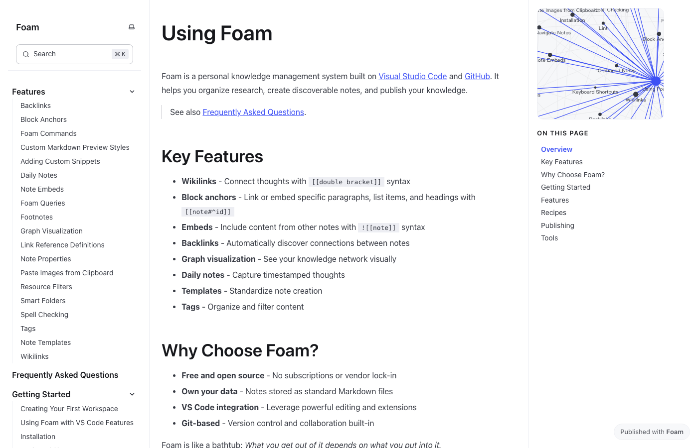

# Research Note Sandbox

Archived Foam-based markdown knowledge-base sandbox.

<p align="center">
  
</p>

> Preview image source: the public Foam documentation site at https://foambubble.github.io/foam/.

## What This Is

This repository began as a small Foam/VS Code test workspace. It is kept public for historical continuity, but it is not an actively maintained software project.

## Contents

```text
inbox.md             quick notes
todo.md              task notes
getting-started.md   original Foam starter note
_layouts/            Jekyll layout files from the starter template
.vscode/             Foam workspace settings
```

## Recommended Active Projects

For current work, see the maintained research-tooling and macOS utility repositories on this account, including DailyDesk, AI paper radars, and image-restoration project pages.

## Upstream

Foam is documented at https://foambubble.github.io/foam/ and maintained at https://github.com/foambubble/foam.
